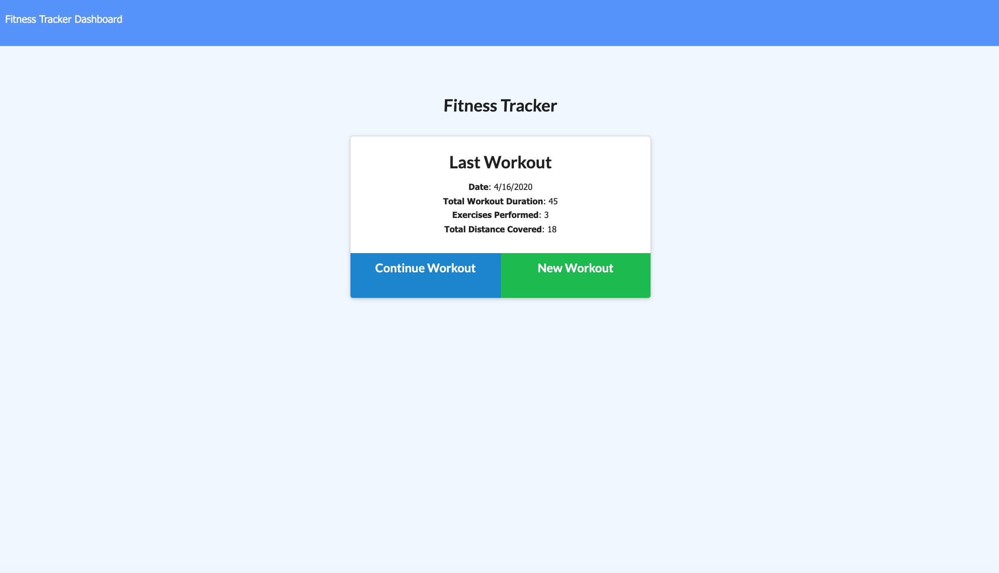
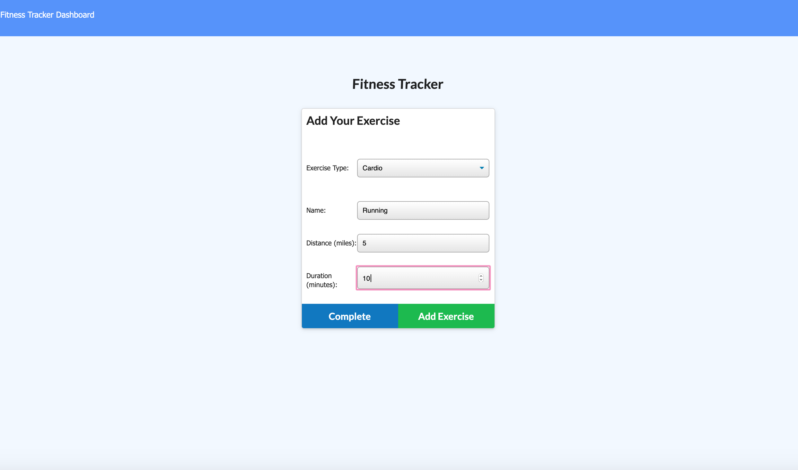
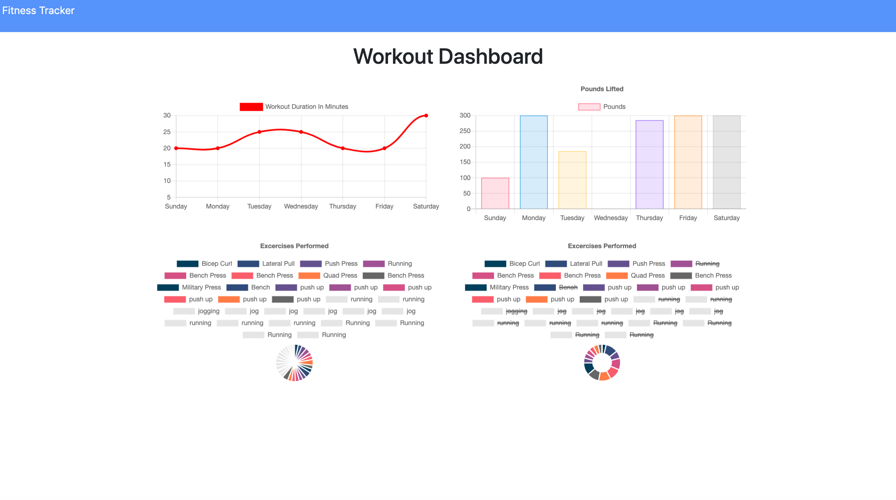

# Workout_Tracker

## Description
* ​This is an app that allows users to track and update their workouts by adding resistance and cardio workouts for the day. 

# Images

## Links
* Github: https://tabby-lab.github.io/Workout_Tracker/
* Heroku: https://workouttracker44.herokuapp.com/?id=5e990ae13c017a001718f2b2

## Installation
npm i

## Languages
* mongoose
* mongodb
* node.js
* HTML
* CSS
* Javascript

## Run
* npm start/node server.js
